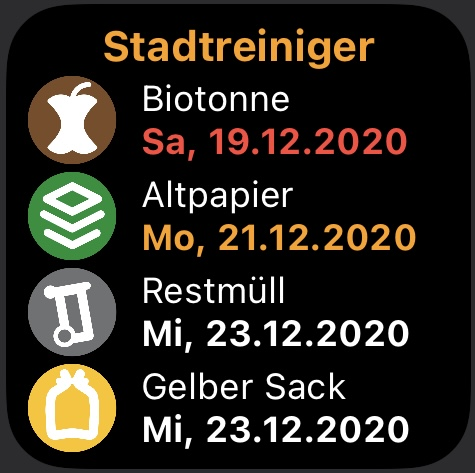

# StadtreinigerKS
Widget um die nächsten Abholtermine der Stadtreiniger anzuzeigen.

### Features
- Zeigt die nächsten Abholtermine für die verschiedenen Abfallarten.
- Zwei Tage vor der nächsten Abholung wird das Datum orange. 
- Einen Tag vorher wird's dann rot.
- Ein Klick auf das Widget führt zur Webseite der Stadtreiniger

 

### Konfiguration
Das Widget benötigt eine bmsLocationId. Diese kann mit folgenden Schritten ermittelt werden.

1. Öffne die Webseite https://insert-it.de/BMSAbfallkalenderKassel/ 
2. Gebe dort deine Strasse und Hausnummer ein
3. Es erscheint nun ein Kalender
4. In der URL (Adresszeile des Browsers) findest du einen Parameter ...bmsLocationId=
5. Die dort genannte Zahl ist die notwendige bmsLocationId (z.B. 104242 für den Kirchweg 17)
6. Diese Nummer musst du als Paremeter in der Widget-Konfiguration eintragen

### Tipps
Die Begriffe "Restmüll", "Biotonne" und "Gelber Sack" sind die in unserer Famile gebräuchlichen Ausdrücke.
Wenn du das aber z.B. "Abfall", "Essensreste" und "Gelbe Tonne" nennst, so können die Bezeichnungen im Code angepasst werden.
Hierzu einfach die Begriffe im Array "myMuell" anpassen.

### Known Bugs
Es gibt leider nur ein Icon der Stadtreiniger auf hellem Hintergrund.
Im Dunkelmodus wird daher auf ein Icon verzichtet.
Wer ganz auf ein Icon verzichten möchte, muss im Code faviconURL = "" setzen

### ChangeLog
- 2020-12-18 initial version
- 2020-12-19 ADD: Sortierung nach Datum (nächste Abholung la serster Eintrag, bei gleichem Abholdatum, gilt die Reihenfolge des Arrays)
- 2020-12-19 ADD: In einigen Bereich, gibt es keine Biotonne, dann wird das nun auch nicht angezeigt (Alternativ kann die Anzeige aktiviert werden, dann wird als Datum "--" angezeigt) - Anpassung im Code showNotCollectedGarbage=true
- 2020-12-19 ADD: Unterstützung des Altpapiertonne
- 2020-12-19 ADD: Flexiblere Layoutgestaltung, angepasst auf die Anzahl der dargestellten Einträge (2-4)
- 2020-12-19 ADD: Neue Icons vom Abfallkalender Kreis Kassel
- 2020-12-19 FIX: Kleinere Anpassungen
- 2020-12-23 CHG: Gelber Sack wird Gelbe Tonne
- 2020-12-23 CHG: Refresh Verhalten geändert.
- 2020-12-23 CHG: Widget URL führt jetzt direkt zum entsprechenden Abfallkalender (StreetID kann übergeben werden, um dies zu optimieren, funktioneirt aber auch ohne)
