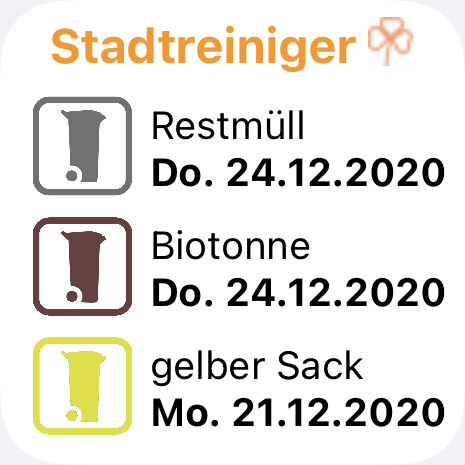
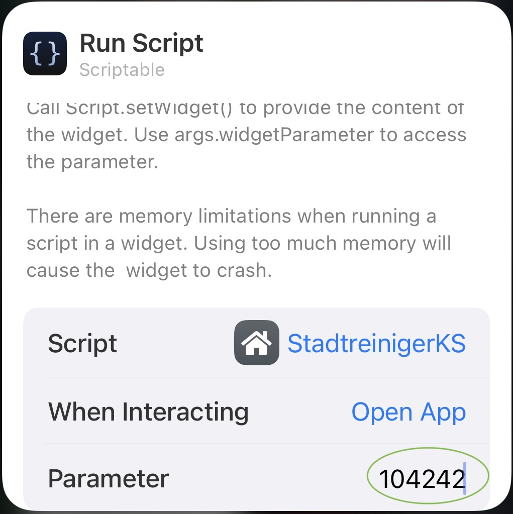

# StadreinigerKS
Widget um die nächsten Abholtermine der Stadtreiniger anzuzeigen.

Zwei Tage vor der nächsten Abholung wird das Datum orange. 

Einen Tag vorher wird's dann rot.

### Konfiguration
Das Widget benötigt eine bmsLocationId. Diese kann mit folgenden Schritten ermittelt werden.

1. Öffne die Webseite https://insert-it.de/BMSAbfallkalenderKassel/ 
2. Gebe dort deine Strasse und Hausnummer ein
3. Es erscheint nun ein Kalender
4. In der URL (Adresszeile des Browsers) findest du einen Parameter ...bmsLocationId=
5. Die dort genannte Zahl is die notwendige bmsLocationId (z.B. 104242 für den Kirchweg 17)
6. Diese Nummer musst du als Paremeter in der Widget-Konfiguration eintragen

### Tipps
Die Begriffe "Restmüll", "Biotonne" und "Gelber Sack" sind die in unserer Famile gebräuchlichen Ausdrücke.
Wenn ich das aber z.B. "Abfall", "Essensreste" und "Gelbe Tonne" nennt, so können die Bezeichnungn im Code angepasst werden.
Hierzu einfach die Begriffe im Array "myMuell" anpassen.

### Known Bugs
Es gibt leider nur ein Icon der Stadtreinierger auf hellem Hintergrund.
Im Dunkelmodus wird daher auf ein Icon verzichtet.
Wer ganz auf ein Icon verzichten möchte, muss im Code faviconURL = "" setzen

### ChangeLog
- 2020-12-18 initial version
